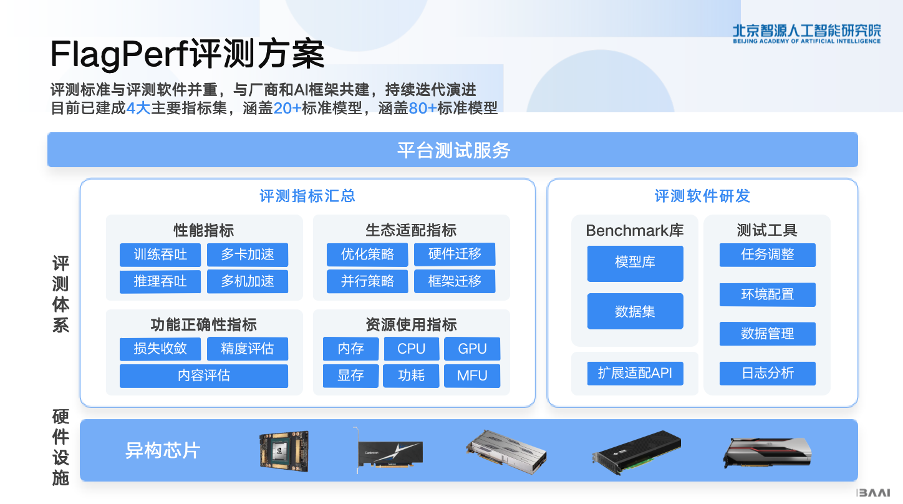

----------
### FlagPerf
[](https://github.com/FlagOpen/FlagPerf/actions/workflows/super-linter.yml)

FlagPerf 是智源研究院联合AI硬件厂商共建的一体化AI硬件评测引擎，旨在建立以产业实践为导向的指标体系，评测AI硬件在软件栈组合（模型+框架+编译器）下的实际能力。我们希望探索开源、开放、灵活、公正、客观的AI芯片评测体系，提供行业价值，促进AI产业生态发展。

----------

### 评测方案及特性



1. 构建多维度评测指标体系，不止关注“耗时”:
  FlagPerf 指标体系除了衡量“芯片能否支持特定模型训练”的功能正确性指标之外，还包含更多维度的性能指标、资源使用指标以及生态适配能力指标等。
指标详细介绍见
[FlagPerf v1.0 发布，构建开源开放的AI硬件评测生态](https://mp.weixin.qq.com/s/rwTFsthioBty5W2P-Lg9iw)

2. 支持多样例场景及任务，覆盖大模型训练推理场景
FlagPerf 已经涵盖计算机视觉、自然语言处理、语音等领域的20余个经典模型，80余个训练样例，支持评测AI硬件的训练和推理能力，以及大模型场景的推理任务评测。

3. 支持多训练框架及推理引擎，灵活连接AI硬件与软件生态

    在训练任务场景中，除了支持 PyTorch、TensorFlow，FlagPerf 还在积极与 PaddlePaddle、MindSpore 研发团队密切配合。作为国产训练框架的领军者，百度 Paddle团队、华为昇思MindSpore 团队正在将 Llama、GPT3 等明星模型集成至 FlagPerf 测试样例集。

    在推理任务场景中，FlagPerf 适配了多家芯片厂商和训练框架研发团队的推理加速引擎，以更灵活地连接AI硬件与软件生态，拓宽评测的边界和效率，如英伟达TensorRT、昆仑芯XTCL（XPU Tensor Compilation Library）、天数智芯IxRT（Iluvatar CoreX RunTime）、PyTorch TorchInductor。

4. 支持多测试环境，综合考察单卡、单机、多机性能

    为全面评估国产AI芯片多样性、可扩展性、实际应用模拟情况，FlagPerf 设定了单卡、单机（通常是8卡）、多机三个测试环境，为不同的测试环境匹配了不同测试样例场景和任务。
    
    >注：当前FlagPerf在保证测试环境除芯片外其他条件一致的情况下，进行芯片本身的离线批处理评测，暂不支持集群和客户端的性能评估。

5. 严格审核参评代码，关注“结果公平”，更关注“过程公正”
    
    测试由智源研究院与众多芯片厂商联合展开。总体原则是确保客观、公平地评估芯片的通用性能，限制厂商开展有针对性的定制优化。在确定测试模型之后，首先由芯片厂商进行模型适配，这个过程中只允许厂商进行分镜像环境、批数据量（batch size）等和硬件执行强相关的方面的代码修改，以确保模型能够在芯片上高效运行。其次由智源研究院依托基准测试平台FlagPerf对芯片能力开展测试，并确保测试过程顺利，芯片性能和稳定性得到最佳发挥。同时，所有测试代码均已开源，测试过程、数据可复现。

    🎯 未来智源及众多AI硬件、框架团队还将共同拓展FlagPerf的评测场景，如开展集群性能的整体评估，以更全面的评估国产软硬件的性能。

### 动态
  - [31 Oct 2023]支持Torch-Aquila 7B预训练，#299
  - [27 Oct 2023]支持Torch-llama2 7B预训练，#289
  - [7 Oct 2023]支持Paddle-GPT3 预训练，#233
  - [27 Sep 2023]发布v1.0版本，支持20余个经典模型，50余个训练样例，支持多家芯片厂商的训练或推理评测 #v1.0
  - [3 Aug 2023]支持推理框架, 支持常见基础模型的离线批推理评测 #136
  - [8 Feb 2023]支持Tensorflow框架#7
  - [6 Feb 2023]昆仑芯作为合作厂商进入共建生态 #6
  - [Dec 2022]天数智芯、百度PaddlePaddle作为最早一批厂商参与初版共建开发
### 支持列表


### 快速上手

#### 基础环境确认
1. 安装docker，python
2. 确保硬件驱动、网络、硬件虚拟化等服务器基础配置齐全
    1. 确保可连中国大陆可访问网站，速率正常
    2. 确保可在容器内找到硬件
    3. 确保各服务器间root帐号的ssh信任关系和sudo免密

#### 训练启动说明

1. 下载FlagPerf并部署

    ```bash
    # 确保各服务器间root帐号的ssh信任关系和sudo免密配置
    git clone https://github.com/FlagOpen/FlagPerf.git
    cd FlagPerf/training/
    pip3 install -r requirements.txt
    ```
2. 修改机器配置文件
    ```bash
    cd Flagperf/training/
    vim run_benchmarks/config/cluster_conf.py
    ```
    集群配置文件主要包括集群主机列表和SSH端口，修改HOSTS和SSH_PORT为机器实际地址

    ```bash
    '''Cluster configs'''
    #Hosts to run the benchmark. Each item is an IP address or a hostname.
    HOSTS = ["10.1.2.3", "10.1.2.4", "10.1.2.5", "10.1.2.6"]
    #ssh connection port
    SSH_PORT = "22"
    ```

3. 修改模型配置文件
    ```bash
    cd Flagperf/training/
    vim run_benchmarks/config/test_conf.py
    ```
    必改项：

    ```bash
    VENDOR = "nvidia" #选择本次运行的硬件
    FLAGPERF_PATH="" # FlagPerf项目路径，如"/home/FlagPerf/training"
    CASES={} # 本次运行的测例，按照对应模型readme准备好数据，修改模型对应的地址

    #如运行"bert:pytorch_1.8:A100:1:8:1": "/raid/home_datasets_ckpt/bert/train/"，需要把:后面的路径替换为本地路径
    ```
4. 启动测试

    ```bash
    python3 ./run_benchmarks/run.py
    sudo python3 ./run_benchmarks/run.py
    ```

5. 查看日志

    ```bash
    cd result/run2023XXXX/运行模型/

    # ls
    round1

    # ls round1/
    10.1.2.2_noderank0

    # cd 10.1.2.2_noderank0/

    # ls
    cpu_monitor.log     pwr_monitor.log  rank2.out.log  rank5.out.log  start_pytorch_task.log
    mem_monitor.log     rank0.out.log    rank3.out.log  rank6.out.log
    nvidia_monitor.log  rank1.out.log    rank4.out.log  rank7.out.log


    # tail -n 6 rank0.out.log
    [PerfLog] {"event": "STEP_END", "value": {"loss": 2.679504871368408, "embedding_average": 0.916015625, "epoch": 1, "end_training": true, "global_steps": 3397, "num_trained_samples": 869632, "learning_rate": 0.000175375, "seq/s": 822.455385237589}, "metadata": {"file": "/workspace/flagperf/training/benchmarks/cpm/pytorch/run_pretraining.py", "lineno": 127, "time_ms": 1669034171032, "rank": 0}}
    [PerfLog] {"event": "EVALUATE", "metadata": {"file": "/workspace/flagperf/training/benchmarks/cpm/pytorch/run_pretraining.py", "lineno": 127, "time_ms": 1669034171032, "rank": 0}}
    [PerfLog] {"event": "EPOCH_END", "metadata": {"file": "/workspace/flagperf/training/benchmarks/cpm/pytorch/run_pretraining.py", "lineno": 127, "time_ms": 1669034171159, "rank": 0}}
    [PerfLog] {"event": "TRAIN_END", "metadata": {"file": "/workspace/flagperf/training/benchmarks/cpm/pytorch/run_pretraining.py", "lineno": 136, "time_ms": 1669034171159, "rank": 0}}
    [PerfLog] {"event": "FINISHED", "value": {"e2e_time": 1661.6114165782928, "training_sequences_per_second": 579.0933420700227, "converged": true, "final_loss": 3.066718101501465, "final_mlm_accuracy": 0.920166015625, "raw_train_time": 1501.713, "init_time": 148.937}, "metadata": {"file": "/workspace/flagperf/training/benchmarks/cpm/pytorch/run_pretraining.py", "lineno": 158, "time_ms": 1669034171646, "rank": 0}}
    ```

#### 推理启动说明
1. 下载FlagPerf并部署
    ```bash
    # 先各服务器间root帐号的ssh信任关系和sudo免密配置
    git clone https://github.com/FlagOpen/FlagPerf.git
    cd FlagPerf/inference/
    pip3 install -r requirements.txt
    ```

2. 修改机器配置文件

    ```bash
    cd Flagperf/inference/
    vim configs/host.yaml
    集群配置文件主要包括集群主机列表和SSH端口，修改HOSTS和SSH_PORT为机器实际地址
    ```
    必须修改项
    ```bash
    FLAGPERF_PATH: "/home/FlagPerf/inference" #FlagPerf inference 路径
    HOSTS: ["127.0.0.1"] # 机器地址
    VENDOR = "nvidia" #测试机器对象，nvidia/kunlunxin/iluvatar
    CASES:  #待测case，记得修改数据地址
        "resnet50:pytorch_1.13": "/raid/dataset/ImageNet/imagenet/val"
    ```

3. 用户需要根据评测对象，配置configs/<case>/configuration.yaml，如不修改可用默认配置
    ```bash
    batch_size: 256

    # 1 item(like 1 sequence, 1 image) flops
    # Attention! For transformer decoder like bert, 1 token cause 2*param flops, so we need 2*length*params like 2*512*0.33B here
    # format: a_1*a*2*...*a_nea_0,like 2*512*0.33e9(bert) or 4.12e9(resnet50)
    flops: 4.12e9
    fp16: true
    compiler: tensorrt
    num_workers: 8
    log_freq: 30
    repeat: 5
    # skip validation(will also skip create_model, export onnx). Assert exist_onnx_path != null
    no_validation: false
    # set a real onnx_path to use exist, or set it to anything but null to avoid export onnx manually(like torch-tensorrt)
    exist_onnx_path: null
    # set a exist path of engine file like resnet50.trt/resnet50.plan/resnet50.engine
    exist_compiler_path: null
    ```
    必改项：
    ```bash
    VENDOR = "nvidia" #选择本次运行的硬件
    FLAGPERF_PATH="" # FlagPerf项目路径，如"/home/FlagPerf/training"
    CASES={} # 本次运行的测例，按照对应模型readme准备好数据，修改模型对应的地址
    #如运行"bert:pytorch_1.8:A100:1:8:1": "/raid/home_datasets_ckpt/bert/train/"，需要把:后面的路径替换为本地路径
    ```

4. 启动测试
    ```bash
    sudo python inference/run.py
    ```
    
- 更多训练/推理说明见[训练文档](https://github.com/FlagOpen/FlagPerf/tree/main/training/README.md) [推理文档](https://github.com/FlagOpen/FlagPerf/blob/main/docs/dev/inference-case-doc.md)


### 如何参与共建【to 开发者】
  - 开发者文章：更多操作教程见 docs-zh
  - 参与共建大概的工作量

    为了更直观的展示厂商参与共建的实际工作量，下面给出6个已经合并进FlagPerf，面向不同特征厂商的Pull Request：
    1. 当某厂商第一次参与训练适配，需要适配的内容较多。除了适配case外，还包括厂商的dockerfile、monitor等，如https://github.com/FlagOpen/FlagPerf/pull/246
    2. 当某厂商后续参与训练适配时，如厂商以cuda兼容路线设计软硬件，典型适配case如https://github.com/FlagOpen/FlagPerf/pull/170
    3. 当某厂商后续参与训练适配时，如厂商不兼容cuda，则需要额外修改后端通信方案等等。典型适配case如https://github.com/FlagOpen/FlagPerf/pull/288。当case较复杂时，可能需要重写部分计算方式、半精度接口等，如https://github.com/FlagOpen/FlagPerf/pull/158
    4. 当某厂商第一次参与推理适配，需要适配的内容较多。除了适配case外，还包括厂商的dockerfile、编译器实现方式、monitor等，如https://github.com/FlagOpen/FlagPerf/pull/256
    5. 当某厂商后续参与推理适配时，通常不需要适配工作量、仅需运行软件完成测试。如https://github.com/FlagOpen/FlagPerf/pull/227


### 当前合作伙伴

    本项目目前由北京智源人工智能研究院、天数智芯、百度PaddlePaddle、昆仑芯、华为昇腾、华为昇思MindSpore、摩尔线程、腾讯九霄共同建设中。

    诚邀各框架、芯片、编译器团队与个人参与！


### 联系我们

flagperf@baai.ac.cn
### 许可证
本项目基于Apache 2.0 license。 
<br>本项目的代码来源于不同的代码仓库，关于各模型测试Case的情况，请参考各模型测试Case目录的文档。