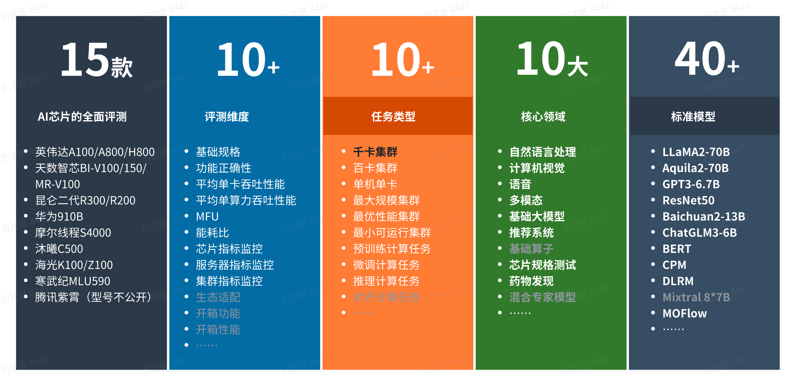

----------
## FlagPerf是什么
[](https://github.com/FlagOpen/FlagPerf/actions/workflows/super-linter.yml)

**FlagPerf是智源研究院联合AI硬件厂商共建的一体化AI硬件评测引擎，旨在建立以产业实践为导向的指标体系，评测AI硬件在软件栈组合（模型+框架+编译器）下的实际能力。**

## 📣 FlagPerf评测亮点



1. **构建多维度评测指标体系，不止关注“耗时”:**

   FlagPerf 指标体系除了衡量“芯片能否支持特定模型训练”的功能正确性指标之外，还包含更多维度的性能指标、资源使用指标以及生态适配能力指标等。
   
   > 指标详细介绍见 [这篇文章](https://mp.weixin.qq.com/s/rwTFsthioBty5W2P-Lg9iw)

2. **支持多样例场景及任务，覆盖大模型训练推理场景**

   FlagPerf 已经涵盖计算机视觉、自然语言处理、语音、多模态等领域的**30余个经典模型，80余个训练样例，**支持评测AI硬件的训练和推理能力，以及大模型场景的推理任务评测。
   
3. **支持多训练框架及推理引擎，灵活连接AI硬件与软件生态**

   **在训练任务场景中**，除了支持 PyTorch、TensorFlow，FlagPerf 还在积极与 PaddlePaddle、MindSpore 研发团队密切配合。作为国产训练框架的领军者，百度 Paddle团队、华为昇思MindSpore 团队正在将 Llama、GPT3 等明星模型集成至 FlagPerf 测试样例集。

   **在推理任务场景中**，FlagPerf 适配了多家芯片厂商和训练框架研发团队的推理加速引擎，以更灵活地连接AI硬件与软件生态，拓宽评测的边界和效率，如英伟达TensorRT、昆仑芯XTCL（XPU Tensor Compilation Library）、天数智芯IxRT（Iluvatar CoreX RunTime）、PyTorch TorchInductor。

4. **支持多测试环境，综合考察单卡、单机、多机性能**

   为全面评估国产AI芯片多样性、可扩展性、实际应用模拟情况，FlagPerf 设定了单卡、单机（通常是8卡）、多机三个测试环境，为不同的测试环境匹配了不同测试样例场景和任务。

   > 注：当前FlagPerf在保证测试环境除芯片外其他条件一致的情况下，进行芯片本身的离线批处理评测，暂不支持集群和客户端的性能评估。

5. **严格审核参评代码，关注“结果公平”，更关注“过程公正”**

   测试由智源研究院与众多芯片厂商联合展开。总体原则是确保客观、公平地评估芯片的通用性能，限制厂商开展有针对性的定制优化。在确定测试模型之后，首先由芯片厂商进行模型适配，这个过程中**只允许厂商进行分布式通信、批数据量（batch size）等和硬件执行强相关的方面的代码修改**，以确保模型能够在芯片上高效运行。其次由智源研究院依托基准测试平台FlagPerf对芯片能力开展测试，并确保测试过程顺利，芯片性能和稳定性得到最佳发挥。同时，**所有测试代码均已开源，测试过程、数据可复现。**

🎯 未来智源及众多AI硬件、框架团队还将共同拓展FlagPerf的评测场景，如开展集群性能的整体评估，以更全面的评估国产软硬件的性能。

## News 

- [31 Oct 2023]支持Torch-Aquila 7B预训练，[#299](https://github.com/FlagOpen/FlagPerf/pull/136)
- [27 Oct 2023]支持Torch-llama2 7B预训练，[#289](https://github.com/FlagOpen/FlagPerf/pull/136)
- [7 Oct 2023]支持Paddle-GPT3 预训练，[#233](https://github.com/FlagOpen/FlagPerf/pull/136)
- [27 Sep 2023]发布v1.0版本，支持20余个经典模型，50余个训练样例，支持多家芯片厂商的训练或推理评测 [#v1.0](https://github.com/FlagOpen/FlagPerf/releases/tag/1.0)
- [3 Aug 2023]支持推理框架, 支持常见基础模型的离线批推理评测 [#136](https://github.com/FlagOpen/FlagPerf/pull/136)
- [8 Feb 2023]支持Tensorflow框架[#7](https://github.com/FlagOpen/FlagPerf/pull/7)
- [6 Feb 2023]昆仑芯作为合作厂商进入共建生态 [#6](https://github.com/FlagOpen/FlagPerf/pull/6)
- [Dec 2022]天数智芯、百度PaddlePaddle作为最早一批厂商参与初版共建开发

## 支持列表

训练列表：

<table border="1" class="dataframe">
  <thead>
    <tr style="text-align: left;">
      <th>编号</th>
        <th>模型名称</th>
      <th>模型类型</th>
      <th>英伟达</th>
      <th>昆仑芯</th>
      <th>天数智芯</th>
      <th>摩尔线程</th>
    </tr>
  </thead>
  <tbody>
    <tr>
      <td>1</td>
        <td><a href="https://github.com/FlagOpen/FlagPerf/tree/main/training/benchmarks/aquila2_7b">aquila2_7b</a></td>
      <td>NLP</td>
      <td><a href="https://github.com/FlagOpen/FlagPerf/tree/main/training/nvidia/aquila2_7b-flagscale">flagscale（megatron）</a></td>
      <td>N/A</td>
      <td>N/A</td>
        <td>N/A</td>
    </tr>
    <tr>
      <td>2</td>
        <td><a href="https://github.com/FlagOpen/FlagPerf/tree/main/training/benchmarks/bert">bert</a></td>
      <td>NLP</td>
      <td><a href="https://github.com/FlagOpen/FlagPerf/tree/main/training/nvidia/bert-paddle">paddle</a>, <a href="https://github.com/FlagOpen/FlagPerf/tree/main/training/nvidia/bert-pytorch">pytorch</a></td>
      <td><a href="https://github.com/FlagOpen/FlagPerf/tree/main/training/kunlunxin/bert-paddle">paddle</a>, <a href="https://github.com/FlagOpen/FlagPerf/tree/main/training/kunlunxin/bert-pytorch">pytorch</a></td>
      <td><a href="https://github.com/FlagOpen/FlagPerf/tree/main/training/iluvatar/bert-paddle">paddle</a>, <a href="https://github.com/FlagOpen/FlagPerf/tree/main/training/iluvatar/bert-pytorch">pytorch</a></td>
        <td>N/A</td>
    </tr>
    <tr>
      <td>3</td>
        <td><a href="https://github.com/FlagOpen/FlagPerf/tree/main/training/benchmarks/bert_hf">bert_hf</a></td>
      <td>NLP</td>
      <td><a href="https://github.com/FlagOpen/FlagPerf/tree/main/training/nvidia/bert_hf-pytorch">pytorch</a></td>
      <td>N/A</td>
      <td>N/A</td>
        <td><a href="https://github.com/FlagOpen/FlagPerf/tree/main/training/mthreads/bert_hf-pytorch">pytorch</a></td>
    </tr>
    <tr>
      <td>4</td>
        <td><a href="https://github.com/FlagOpen/FlagPerf/tree/main/training/benchmarks/bigtransfer">bigtransfer</a></td>
      <td>CV</td>
      <td><a href="https://github.com/FlagOpen/FlagPerf/tree/main/training/nvidia/bigtransfer-pytorch">pytorch</a></td>
      <td><a href="https://github.com/FlagOpen/FlagPerf/tree/main/training/kunlunxin/bigtransfer-pytorch">pytorch</a></td>
      <td><a href="https://github.com/FlagOpen/FlagPerf/tree/main/training/iluvatar/bigtransfer-pytorch">pytorch</a></td>
        <td>N/A</td>
    </tr>
    <tr>
      <td>5</td>
        <td><a href="https://github.com/FlagOpen/FlagPerf/tree/main/training/benchmarks/cpm">cpm</a></td>
      <td>LLM</td>
      <td><a href="https://github.com/FlagOpen/FlagPerf/tree/main/training/nvidia/cpm-pytorch">pytorch</a></td>
      <td><a href="https://github.com/FlagOpen/FlagPerf/tree/main/training/kunlunxin/cpm-pytorch">pytorch</a></td>
      <td><a href="https://github.com/FlagOpen/FlagPerf/tree/main/training/iluvatar/cpm-pytorch">pytorch</a></td>
        <td>N/A</td>
    </tr>
    <tr>
      <td>6</td>
        <td><a href="https://github.com/FlagOpen/FlagPerf/tree/main/training/benchmarks/detr">detr</a></td>
      <td>CV</td>
      <td><a href="https://github.com/FlagOpen/FlagPerf/tree/main/training/nvidia/detr-pytorch">pytorch</a></td>
      <td><a href="https://github.com/FlagOpen/FlagPerf/tree/main/training/kunlunxin/detr-pytorch">pytorch</a></td>
      <td>N/A</td>
        <td>N/A</td>
    </tr>
    <tr>
      <td>7</td>
        <td><a href="https://github.com/FlagOpen/FlagPerf/tree/main/training/benchmarks/distilbert">distilbert</a></td>
      <td>NLP</td>
      <td><a href="https://github.com/FlagOpen/FlagPerf/tree/main/training/nvidia/distilbert-pytorch">pytorch</a></td>
      <td><a href="https://github.com/FlagOpen/FlagPerf/tree/main/training/kunlunxin/distilbert-pytorch">pytorch</a></td>
      <td>N/A</td>
        <td>N/A</td>
    </tr>
    <tr>
     <td>8</td>
        <td><a href="https://github.com/FlagOpen/FlagPerf/tree/main/training/benchmarks/efficientnet">efficientnet</a></td>
      <td>CV</td>
      <td><a href="https://github.com/FlagOpen/FlagPerf/tree/main/training/nvidia/efficientnet-pytorch">pytorch</a></td>
      <td><a href="https://github.com/FlagOpen/FlagPerf/tree/main/training/kunlunxin/efficientnet-pytorch">pytorch</a></td>
      <td><a href="https://github.com/FlagOpen/FlagPerf/tree/main/training/iluvatar/efficientnet-pytorch">pytorch</a></td>
        <td>N/A</td>
    </tr>
    <tr>
      <td>9</td>
        <td><a href="https://github.com/FlagOpen/FlagPerf/tree/main/training/benchmarks/faster_rcnn">faster_rcnn</a></td>
      <td>CV</td>
      <td><a href="https://github.com/FlagOpen/FlagPerf/tree/main/training/nvidia/faster_rcnn-pytorch">pytorch</a></td>
      <td><a href="https://github.com/FlagOpen/FlagPerf/tree/main/training/kunlunxin/faster_rcnn-pytorch">pytorch</a></td>
      <td><a href="https://github.com/FlagOpen/FlagPerf/tree/main/training/iluvatar/faster_rcnn-pytorch">pytorch</a></td>
        <td>N/A</td>
    </tr>
    <tr>
      <td>10</td>
        <td><a href="https://github.com/FlagOpen/FlagPerf/tree/main/training/benchmarks/glm">glm</a></td>
      <td>LLM</td>
      <td><a href="https://github.com/FlagOpen/FlagPerf/tree/main/training/nvidia/glm-pytorch">pytorch</a></td>
      <td><a href="https://github.com/FlagOpen/FlagPerf/tree/main/training/kunlunxin/glm-pytorch">pytorch</a></td>
      <td><a href="https://github.com/FlagOpen/FlagPerf/tree/main/training/iluvatar/glm-pytorch">pytorch</a></td>
        <td>N/A</td>
    </tr>
    <tr>
      <td>11</td>
        <td><a href="https://github.com/FlagOpen/FlagPerf/tree/main/training/benchmarks/gpt2">gpt2</a></td>
      <td>LLM</td>
      <td><a href="https://github.com/FlagOpen/FlagPerf/tree/main/training/nvidia/gpt2-pytorch">pytorch</a></td>
      <td><a href="https://github.com/FlagOpen/FlagPerf/tree/main/training/kunlunxin/gpt2-pytorch">pytorch</a></td>
      <td>N/A</td>
        <td>N/A</td>
    </tr>
    <tr>
     <td>12</td> 
        <td><a href="https://github.com/FlagOpen/FlagPerf/tree/main/training/benchmarks/gpt3_13B">gpt3_13B</a></td>
      <td>LLM</td>
      <td><a href="https://github.com/FlagOpen/FlagPerf/tree/main/training/nvidia/gpt3_13B-paddle">paddle</a></td>
      <td>N/A</td>
      <td>N/A</td>
        <td>N/A</td>
    </tr>
    <tr>
      <td>13</td>
        <td><a href="https://github.com/FlagOpen/FlagPerf/tree/main/training/benchmarks/gpt3_6.7B">gpt3_6.7B</a></td>
      <td>LLM</td>
      <td><a href="https://github.com/FlagOpen/FlagPerf/tree/main/training/nvidia/gpt3_6.7B-paddle">paddle</a></td>
      <td>N/A</td>
      <td>N/A</td>
        <td>N/A</td>
    </tr>
    <tr>
      <td>14</td>
        <td><a href="https://github.com/FlagOpen/FlagPerf/tree/main/training/benchmarks/llama1_13B">llama1_13B</a></td>
      <td>LLM</td>
      <td><a href="https://github.com/FlagOpen/FlagPerf/tree/main/training/nvidia/llama1_13B-paddle">paddle</a></td>
      <td>N/A</td>
      <td>N/A</td>
        <td>N/A</td>
    </tr>
    <tr>
      <td>15</td>
        <td><a href="https://github.com/FlagOpen/FlagPerf/tree/main/training/benchmarks/llama1_7B">llama1_7B</a></td>
      <td>LLM</td>
      <td><a href="https://github.com/FlagOpen/FlagPerf/tree/main/training/nvidia/llama1_7B-paddle">paddle</a></td>
      <td>N/A</td>
      <td>N/A</td>
        <td>N/A</td>
    </tr>
    <tr>
      <td>16</td>
        <td><a href="https://github.com/FlagOpen/FlagPerf/tree/main/training/benchmarks/llama2_7b">llama2_7b</a></td>
      <td>LLM</td>
      <td><a href="https://github.com/FlagOpen/FlagPerf/tree/main/training/nvidia/llama2_7b-deepspeed">deepspeed</a></td>
      <td><a href="https://github.com/FlagOpen/FlagPerf/pull/348">deepspeed</a></td>
      <td><a href="https://github.com/FlagOpen/FlagPerf/pull/343">deepspeed</a></td>
        <td><a href="https://github.com/FlagOpen/FlagPerf/pull/354">deepspeed</a></td>
    </tr>
      <tr>
      <td>17</td>
          <td><a href="https://github.com/FlagOpen/FlagPerf/tree/main/training/benchmarks/llama2_7b_finetune">llama2_7b_finetune</a></td>
      <td>LLM</td>
      <td><a href="https://github.com/FlagOpen/FlagPerf/tree/main/training/nvidia/llama2_7b_finetune-pytorch">pytorch</a></td>
      <td>N/A</td>
      <td>N/A</td>
      <td>N/A</td>
    </tr>
    <tr>
      <td>18</td>
        <td><a href="https://github.com/FlagOpen/FlagPerf/tree/main/training/benchmarks/longformer">longformer</a></td>
      <td>NLP</td>
      <td><a href="https://github.com/FlagOpen/FlagPerf/tree/main/training/nvidia/longformer-pytorch">pytorch</a></td>
        <td><a href="https://github.com/FlagOpen/FlagPerf/tree/main/training/kunlunxin/longformer-pytorch">pytorch</a></td>
      <td>N/A</td>
      <td>N/A</td>
    </tr>
    <tr>
      <td>19</td>
        <td><a href="https://github.com/FlagOpen/FlagPerf/tree/main/training/benchmarks/mask_rcnn">mask_rcnn</a></td>
      <td>CV</td>
      <td><a href="https://github.com/FlagOpen/FlagPerf/tree/main/training/nvidia/mask_rcnn-pytorch">pytorch</a></td>
      <td><a href="https://github.com/FlagOpen/FlagPerf/tree/main/training/kunlunxin/mask_rcnn-pytorch">pytorch</a></td>
      <td><a href="https://github.com/FlagOpen/FlagPerf/tree/main/training/iluvatar/mask_rcnn-pytorch">pytorch</a></td>
        <td>N/A</td>
    </tr>
    <tr>
      <td>20</td>
        <td><a href="https://github.com/FlagOpen/FlagPerf/tree/main/training/benchmarks/mobilenetv2">mobilenetv2</a></td>
      <td>CV</td>
      <td><a href="https://github.com/FlagOpen/FlagPerf/tree/main/training/nvidia/mobilenetv2-pytorch">pytorch</a></td>
      <td><a href="https://github.com/FlagOpen/FlagPerf/tree/main/training/kunlunxin/mobilenetv2-pytorch">pytorch</a></td>
      <td><a href="https://github.com/FlagOpen/FlagPerf/tree/main/training/iluvatar/mobilenetv2-pytorch">pytorch</a></td>
        <td>N/A</td>
    </tr>
    <tr>
      <td>21</td>
        <td><a href="https://github.com/FlagOpen/FlagPerf/tree/main/training/benchmarks/resnet50">resnet50</a></td>
      <td>CV</td>
      <td><a href="https://github.com/FlagOpen/FlagPerf/tree/main/training/nvidia/resnet50-pytorch">pytorch</a>, <a href="https://github.com/FlagOpen/FlagPerf/tree/main/training/nvidia/resnet50-tensorflow2">tensorflow2</a></td>
      <td><a href="https://github.com/FlagOpen/FlagPerf/tree/main/training/kunlunxin/resnet50-pytorch">pytorch</a></td>
      <td><a href="https://github.com/FlagOpen/FlagPerf/tree/main/training/iluvatar/resnet50-pytorch">pytorch</a></td>
        <td><a href="https://github.com/FlagOpen/FlagPerf/tree/main/training/mthreads/resnet50-pytorch">pytorch</a></td>
    </tr>
    <tr>
      <td>22</td>
        <td><a href="https://github.com/FlagOpen/FlagPerf/tree/main/training/benchmarks/retinanet">retinanet</a></td>
      <td>CV</td>
      <td><a href="https://github.com/FlagOpen/FlagPerf/tree/main/training/nvidia/retinanet-pytorch">pytorch</a></td>
      <td><a href="https://github.com/FlagOpen/FlagPerf/tree/main/training/kunlunxin/retinanet-pytorch">pytorch</a></td>
      <td><a href="https://github.com/FlagOpen/FlagPerf/tree/main/training/iluvatar/retinanet-pytorch">pytorch</a></td>
        <td>N/A</td>
    </tr>
    <tr>
      <td>23</td>
        <td><a href="https://github.com/FlagOpen/FlagPerf/tree/main/training/benchmarks/swin_transformer">swin_transformer</a></td>
      <td>CV</td>
      <td><a href="https://github.com/FlagOpen/FlagPerf/tree/main/training/nvidia/swin_transformer-pytorch">pytorch</a></td>
      <td><a href="https://github.com/FlagOpen/FlagPerf/tree/main/training/kunlunxin/swin_transformer-pytorch">pytorch</a></td>
      <td><a href="https://github.com/FlagOpen/FlagPerf/tree/main/training/iluvatar/swin_transformer-pytorch">pytorch</a></td>
        <td>N/A</td>
    </tr>
    <tr>
      <td>24</td>
        <td><a href="https://github.com/FlagOpen/FlagPerf/tree/main/training/benchmarks/t5_small">t5_small</a></td>
      <td>NLP</td>
      <td><a href="https://github.com/FlagOpen/FlagPerf/tree/main/training/nvidia/t5_small-pytorch">pytorch</a></td>
      <td><a href="https://github.com/FlagOpen/FlagPerf/tree/main/training/kunlunxin/t5_small-pytorch">pytorch</a></td>
      <td>N/A</td>
        <td>N/A</td>
    </tr>
    <tr>
      <td>25</td>
        <td><a href="https://github.com/FlagOpen/FlagPerf/tree/main/training/benchmarks/tacotron2">tacotron2</a></td>
      <td>Audio</td>
      <td><a href="https://github.com/FlagOpen/FlagPerf/tree/main/training/nvidia/tacotron2-pytorch">pytorch</a></td>
      <td><a href="https://github.com/FlagOpen/FlagPerf/tree/main/training/kunlunxin/tacotron2-pytorch">pytorch</a></td>
      <td><a href="https://github.com/FlagOpen/FlagPerf/tree/main/training/iluvatar/tacotron2-pytorch">pytorch</a></td>
        <td>N/A</td>
    </tr>
    <tr>
      <td>26</td>
        <td><a href="https://github.com/FlagOpen/FlagPerf/tree/main/training/benchmarks/transformer">transformer</a></td>
      <td>NLP</td>
      <td><a href="https://github.com/FlagOpen/FlagPerf/tree/main/training/nvidia/transformer-pytorch">pytorch</a></td>
      <td><a href="https://github.com/FlagOpen/FlagPerf/tree/main/training/kunlunxin/transformer-pytorch">pytorch</a></td>
      <td><a href="https://github.com/FlagOpen/FlagPerf/tree/main/training/iluvatar/transformer-pytorch">pytorch</a></td>
        <td>N/A</td>
    </tr>
    <tr>
      <td>27</td>
        <td><a href="https://github.com/FlagOpen/FlagPerf/tree/main/training/benchmarks/transformer_xl">transformer_xl</a></td>
      <td>NLP</td>
      <td><a href="https://github.com/FlagOpen/FlagPerf/tree/main/training/nvidia/transformer_xl-pytorch">pytorch</a></td>
      <td><a href="https://github.com/FlagOpen/FlagPerf/tree/main/training/kunlunxin/transformer_xl-pytorch">pytorch</a></td>
      <td>N/A</td>
        <td>N/A</td>
    </tr>
    <tr>
      <td>28</td>
        <td><a href="https://github.com/FlagOpen/FlagPerf/tree/main/training/benchmarks/vit">vit</a></td>
      <td>CV</td>
      <td><a href="https://github.com/FlagOpen/FlagPerf/tree/main/training/nvidia/vit-pytorch">pytorch</a></td>
      <td><a href="https://github.com/FlagOpen/FlagPerf/tree/main/training/kunlunxin/vit-pytorch">pytorch</a></td>
      <td><a href="https://github.com/FlagOpen/FlagPerf/tree/main/training/iluvatar/vit-pytorch">pytorch</a></td>
        <td>N/A</td>
    </tr>
    <tr>
      <td>29</td>
        <td><a href="https://github.com/FlagOpen/FlagPerf/tree/main/training/benchmarks/wav2vec2">wav2vec2</a></td>
      <td>Audio</td>
      <td><a href="https://github.com/FlagOpen/FlagPerf/tree/main/training/nvidia/wav2vec2-pytorch">pytorch</a></td>
      <td><a href="https://github.com/FlagOpen/FlagPerf/tree/main/training/kunlunxin/wav2vec2-pytorch">pytorch</a></td>
      <td>N/A</td>
        <td>N/A</td>
    </tr>
    <tr>
      <td>30</td>
        <td><a href="https://github.com/FlagOpen/FlagPerf/tree/main/training/benchmarks/WaveGlow">WaveGlow</a></td>
      <td>Audio</td>
      <td><a href="https://github.com/FlagOpen/FlagPerf/tree/main/training/nvidia/WaveGlow-pytorch">pytorch</a></td>
      <td>N/A</td>
      <td>N/A</td>
        <td>N/A</td>
    </tr>
  </tbody>
</table>


推理列表：

<table width="960" border="0" cellpadding="0" cellspacing="0" style='width:960pt;border-collapse:collapse;table-layout:fixed;'>
   <col width="73.60" style='mso-width-source:userset;mso-width-alt:3588;'/>
   <col width="70" style='mso-width-source:userset;mso-width-alt:3413;'/>
   <col width="200.75" style='mso-width-source:userset;mso-width-alt:9788;'/>
   <col width="195.80" style='mso-width-source:userset;mso-width-alt:9547;'/>
   <col width="185.40" style='mso-width-source:userset;mso-width-alt:9040;'/>
   <tr height="16.80" class="xl65" style='height:16.80pt;'>
   </tr>
   <tr height="16.80" style='height:16.80pt;'>
    <td class="xl65" x:str>编号</td>
       <td class="xl65" x:str>模型名称</td>
       <td class="xl65" x:str>模型类型</td>
    <td class="xl65" x:str>英伟达</td>
    <td class="xl65" x:str>昆仑芯</td>
    <td class="xl65" x:str>天数智芯</td>
    <td class="xl65" x:str>腾讯九霄</td>
   </tr>
   <tr height="16.80" style='height:16.80pt;'>
    <td class="xl65" x:str>1</td>
       <td class="xl65" height="33.60"  style='height:33.60pt;border-right:none;border-bottom:none;' x:str><a href="https://github.com/FlagOpen/FlagPerf/tree/main/inference/benchmarks/resnet50" style="text-decoration:none" target="_parent">resnet50</a></td>
       <td class="xl69" x:str>CV</td>
    <td class="xl69" x:str>f32/f16</td>
    <td class="xl69" x:str>f32/f16</td>
    <td class="xl69" x:str>f16</td>
       <td class="xl69" x:str>f16</td>
   </tr>
    <tr height="16.80" style='height:16.80pt;'>
    <td class="xl65" x:str>2</td>
        <td class="xl65" height="33.60"  style='height:33.60pt;border-right:none;border-bottom:none;' x:str><a href="https://github.com/FlagOpen/FlagPerf/tree/main/inference/benchmarks/bertLarge" style="text-decoration:none" target="_parent">BertLarge</a></td>
        <td class="xl69" x:str>NLP</td>
    <td class="xl69" x:str>f32/f16</td>
    <td class="xl69" x:str>W32A16</td>
    <td class="xl69" x:str>Incoming</td>
        <td class="xl69" x:str>N/A</td>
   </tr>
    <tr height="16.80" style='height:16.80pt;'>
    <td class="xl65" x:str>3</td>
        <td class="xl65" height="33.60"  style='height:33.60pt;border-right:none;border-bottom:none;' x:str><a href="https://github.com/FlagOpen/FlagPerf/tree/main/inference/benchmarks/vit_l_16" style="text-decoration:none" target="_parent">VisionTransformer</a></td>
        <td class="xl69" x:str>CV</td>
    <td class="xl69" x:str>f32/f16</td>
    <td class="xl69" x:str>W32A16</td>
    <td class="xl69" x:str>N/A</td>
        <td class="xl69" x:str>N/A</td>
   </tr>
    <tr height="16.80" style='height:16.80pt;'>
    <td class="xl65" x:str>4</td>
        <td class="xl65" height="33.60" style='height:33.60pt;border-right:none;border-bottom:none;' x:str><a href="https://github.com/FlagOpen/FlagPerf/tree/main/inference/benchmarks/yolov5" style="text-decoration:none" target="_parent">Yolov5_large</a></td>
        <td class="xl69" x:str>CV</td>
    <td class="xl69" x:str>f32/f16</td>
    <td class="xl69" x:str>f32</td>
    <td class="xl69" x:str>f16</td>
        <td class="xl69" x:str>N/A</td>
   </tr>
   <tr height="16.80" style='height:16.80pt;'>
    <td class="xl65" x:str>5</td>
       <td class="xl65" height="33.60"  style='height:33.60pt;border-right:none;border-bottom:none;' x:str><a href="https://github.com/FlagOpen/FlagPerf/tree/main/inference/benchmarks/stable_diffusion_v1_4" style="text-decoration:none" target="_parent">Stable Diffusion v1.4</a></td>
       <td class="xl69" x:str>MultiModal</td>
    <td class="xl69" x:str>f32/f16</td>
    <td class="xl69" x:str>f32</td>
    <td class="xl69" x:str>N/A</td>
       <td class="xl69" x:str>N/A</td>
   </tr>
    <tr height="16.80" style='height:16.80pt;'>
    <td class="xl65" x:str>6</td>
        <td class="xl65" height="33.60"  style='height:33.60pt;border-right:none;border-bottom:none;' x:str><a href="https://github.com/FlagOpen/FlagPerf/tree/main/inference/benchmarks/swinTransformer" style="text-decoration:none" target="_parent">SwinTransformer</td>
        <td class="xl69" x:str>CV</td>
    <td class="xl69" x:str>f32/f16</td>
    <td class="xl69" x:str>W32A16</td>
    <td class="xl69" x:str>N/A</td>
        <td class="xl69" x:str>N/A</td>
   </tr>
    <tr height="16.80" style='height:16.80pt;'>
    <td class="xl65" x:str>7</td>
        <td class="xl65" height="33.60" style='height:33.60pt;border-right:none;border-bottom:none;' x:str><a href="https://github.com/FlagOpen/FlagPerf/tree/main/inference/benchmarks/llama2_7b_mmlu" style="text-decoration:none" target="_parent">Llama2-7B-mmlu</td>
        <td class="xl69" x:str>NLP</td>
    <td class="xl69" x:str>f32/f16</td>
    <td class="xl69" x:str>N/A</td>
    <td class="xl69" x:str>N/A</td>
        <td class="xl69" x:str>N/A</td>
   </tr>
    <tr height="16.80" style='height:16.80pt;'>
    <td class="xl65" x:str>8</td>
        <td class="xl65" height="33.60" style='height:33.60pt;border-right:none;border-bottom:none;' x:str><a href="https://github.com/FlagOpen/FlagPerf/tree/main/inference/benchmarks/aquila_7b_mmlu" style="text-decoration:none" target="_parent">Aquila-7B-mmlu</td>
        <td class="xl69" x:str>NLP</td>
    <td class="xl69" x:str>fp16</td>
    <td class="xl69" x:str>N/A</td>
    <td class="xl69" x:str>N/A</td>
        <td class="xl69" x:str>N/A</td>
    </tr>
<tr height="16.80" style='height:16.80pt;'>
   <td class="xl65" x:str>9</td>
    <td class="xl65" height="33.60" style='height:33.60pt;border-right:none;border-bottom:none;' x:str><a href="https://github.com/FlagOpen/FlagPerf/tree/main/inference/benchmarks/sam" style="text-decoration:none" target="_parent">SegmentAnything</td>
        <td class="xl69" x:str>MultiModal</td>
    <td class="xl69" x:str>fp16</td>
    <td class="xl69" x:str>W32A16</td>
    <td class="xl69" x:str>N/A</td>
        <td class="xl69" x:str>N/A</td>
    </tr></table>


## 如何使用FlagPerf进行AI硬件评测

### 基础环境确认

1. 安装docker，python
2. 确保硬件驱动、网络、硬件虚拟化等服务器基础配置齐全
   1. 确保可连中国大陆可访问网站，速率正常
   2. 确保可在容器内找到硬件
   3. 确保各服务器间root帐号的ssh信任关系和sudo免密
   4. 确保monitor相关工具已安装:包括cpu(sysstat)、内存(free)、功耗(ipmitool)、系统信息(加速卡状态查看命令)。例如ubuntu系统中，使用apt install [sysstat/ipmitool]安装

### 训练启动说明

1. **下载FlagPerf并部署**

```Bash
# 先各服务器间root帐号的ssh信任关系和sudo免密配置
git clone https://github.com/FlagOpen/FlagPerf.git
cd FlagPerf/training/
pip3 install -r requirements.txt
```

2. **修改机器配置文件**

```Bash
cd Flagperf/training/
vim run_benchmarks/config/cluster_conf.py
```

集群配置文件主要包括集群主机列表和SSH端口，修改`HOSTS`和`SSH_PORT`为机器实际地址

```Bash
'''Cluster configs'''
#Hosts to run the benchmark. Each item is an IP address or a hostname.
HOSTS = ["10.1.2.3", "10.1.2.4", "10.1.2.5", "10.1.2.6"]
#ssh connection port
SSH_PORT = "22"
```

3. 修改模型配置文件

```Bash
cd Flagperf/training/
vim run_benchmarks/config/test_conf.py
```

必改项：

```Bash
VENDOR = "nvidia" #选择本次运行的硬件
FLAGPERF_PATH="" # FlagPerf项目路径，如"/home/FlagPerf/training"
CASES={} # 本次运行的测例，按照对应模型readme准备好数据，修改模型对应的地址
#如运行"bert:pytorch_1.8:A100:1:8:1": "/raid/home_datasets_ckpt/bert/train/"，需要把:后面的路径替换为本地路径
```

4. 启动测试

```Bash
python3 ./run_benchmarks/run.py
sudo python3 ./run_benchmarks/run.py
```

5. 查看日志

```Bash
cd result/run2023XXXX/运行模型/
# ls
round1
# ls round1/
10.1.2.2_noderank0
# cd 10.1.2.2_noderank0/
# ls
cpu_monitor.log     pwr_monitor.log  rank2.out.log  rank5.out.log  start_pytorch_task.log
mem_monitor.log     rank0.out.log    rank3.out.log  rank6.out.log
nvidia_monitor.log  rank1.out.log    rank4.out.log  rank7.out.log


# tail -n 6 rank0.out.log
[PerfLog] {"event": "STEP_END", "value": {"loss": 2.679504871368408, "embedding_average": 0.916015625, "epoch": 1, "end_training": true, "global_steps": 3397, "num_trained_samples": 869632, "learning_rate": 0.000175375, "seq/s": 822.455385237589}, "metadata": {"file": "/workspace/flagperf/training/benchmarks/cpm/pytorch/run_pretraining.py", "lineno": 127, "time_ms": 1669034171032, "rank": 0}}
[PerfLog] {"event": "EVALUATE", "metadata": {"file": "/workspace/flagperf/training/benchmarks/cpm/pytorch/run_pretraining.py", "lineno": 127, "time_ms": 1669034171032, "rank": 0}}
[PerfLog] {"event": "EPOCH_END", "metadata": {"file": "/workspace/flagperf/training/benchmarks/cpm/pytorch/run_pretraining.py", "lineno": 127, "time_ms": 1669034171159, "rank": 0}}
[PerfLog] {"event": "TRAIN_END", "metadata": {"file": "/workspace/flagperf/training/benchmarks/cpm/pytorch/run_pretraining.py", "lineno": 136, "time_ms": 1669034171159, "rank": 0}}
[PerfLog] {"event": "FINISHED", "value": {"e2e_time": 1661.6114165782928, "training_sequences_per_second": 579.0933420700227, "converged": true, "final_loss": 3.066718101501465, "final_mlm_accuracy": 0.920166015625, "raw_train_time": 1501.713, "init_time": 148.937}, "metadata": {"file": "/workspace/flagperf/training/benchmarks/cpm/pytorch/run_pretraining.py", "lineno": 158, "time_ms": 1669034171646, "rank": 0}}
```

### 推理启动说明

1. **下载FlagPerf并部署**

```Bash
# 先各服务器间root帐号的ssh信任关系和sudo免密配置
git clone https://github.com/FlagOpen/FlagPerf.git
cd FlagPerf/inference/
pip3 install -r requirements.txt
```

2. **修改机器配置文件**

```Bash
cd Flagperf/inference/
vim configs/host.yaml
```

集群配置文件主要包括集群主机列表和SSH端口，修改`HOSTS`和`SSH_PORT`为机器实际地址

```Bash
#必须修改项
FLAGPERF_PATH: "/home/FlagPerf/inference" #FlagPerf inference 路径
HOSTS: ["127.0.0.1"] # 机器地址
VENDOR = "nvidia" #测试机器对象，nvidia/kunlunxin/iluvatar
CASES:  #待测case，记得修改数据地址
    "resnet50:pytorch_1.13": "/raid/dataset/ImageNet/imagenet/val"
```

3. 用户需要根据评测对象，配置configs/<case>/configuration.yaml，如不修改可用默认配置

```Bash
batch_size: 256
# 1 item(like 1 sequence, 1 image) flops
# Attention! For transformer decoder like bert, 1 token cause 2*param flops, so we need 2*length*params like 2*512*0.33B here
# format: a_1*a*2*...*a_nea_0,like 2*512*0.33e9(bert) or 4.12e9(resnet50)
flops: 4.12e9
fp16: true
compiler: tensorrt
num_workers: 8
log_freq: 30
repeat: 5
# skip validation(will also skip create_model, export onnx). Assert exist_onnx_path != null
no_validation: false
# set a real onnx_path to use exist, or set it to anything but null to avoid export onnx manually(like torch-tensorrt)
exist_onnx_path: null
# set a exist path of engine file like resnet50.trt/resnet50.plan/resnet50.engine
exist_compiler_path: null
```

必改项：

```Bash
VENDOR = "nvidia" #选择本次运行的硬件
FLAGPERF_PATH="" # FlagPerf项目路径，如"/home/FlagPerf/training"
CASES={} # 本次运行的测例，按照对应模型readme准备好数据，修改模型对应的地址
#如运行"bert:pytorch_1.8:A100:1:8:1": "/raid/home_datasets_ckpt/bert/train/"，需要把:后面的路径替换为本地路径
```

4. 启动测试

```Bash
sudo python inference/run.py
```

- 更多训练/推理说明见[训练文档](https://github.com/FlagOpen/FlagPerf/blob/main/training/README.md)和[推理文档](https://github.com/FlagOpen/FlagPerf/blob/main/docs/dev/inference-case-doc.md)

## 参与共建FlagPerf


> 开发者教程：更多操作教程见 [docs-zh](./docs-zh) 

为了更直观的展示厂商参与共建的实际工作量，下面给出6个已经合并进FlagPerf，面向不同特征厂商的Pull Request。

1. 模型训练适配适配

    - **第一次参与训练**适配工作的内容较多。除了适配模型case外，还需要适配厂商的dockerfile、monitor等，如[#246](https://github.com/FlagOpen/FlagPerf/pull/246)
    - **后续参与训练**适配工作量较小：
        - 如厂商以**cuda兼容**路线设计软硬件，典型适配case [#170](https://github.com/FlagOpen/FlagPerf/pull/170)
        - 如厂商**不兼容cuda**，则需要额外修改后端通信方案等等，典型适配case [#288](https://github.com/FlagOpen/FlagPerf/pull/288)。当case较复杂时，可能需要重写部分计算方式、半精度接口等，如[#158](https://github.com/FlagOpen/FlagPerf/pull/158)。

2. 模型推理适配

  - **第一次参与推理**适配的工作内容较多。除了适配case外，还包括厂商的dockerfile、编译器实现方式、monitor等，如 [#256](https://github.com/FlagOpen/FlagPerf/pull/256)
  - **后续参与推理**适配时，通常不需要适配工作量、仅需运行软件完成测试。如 [#227](https://github.com/FlagOpen/FlagPerf/pull/227)

## FlagPerf合作伙伴


## 许可证

本项目基于Apache 2.0 license。 
<br>本项目的代码来源于不同的代码仓库，关于各模型测试Case的情况，请参考各模型测试Case目录的文档。

## 联系我们

如有疑问，可以发送邮件至flagperf@baai.ac.cn，或在[issue](https://github.com/FlagOpen/FlagPerf/issues)中说明情况

