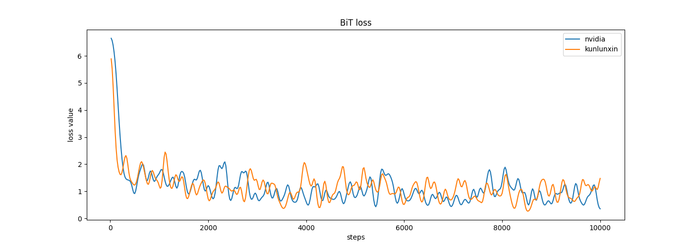

### 迁移预训练权重下载

[迁移预训练权重下载](https://storage.googleapis.com/bit_models/BiT-M-R152x2.npz)

### 数据集下载

[测试数据集下载](https://www.image-net.org/challenges/LSVRC/2012/)

### 昆仑芯XPU配置与运行信息参考
#### 环境配置
- ##### 硬件环境
  - 机器型号: 昆仑芯AI加速器组R480-X8
  - 加速卡型号: 昆仑芯AI加速卡R300
  - 多机网络类型、带宽: InfiniBand，200Gb/s

- ##### 软件环境
  - OS版本：Ubuntu 20.04
  - OS kernel版本: 5.4.0-26-generic
  - 加速卡驱动版本：4.0.25
  - Docker镜像和版本：pytorch1.12.1-cpu-ubuntu18.04:v0.04
  - 训练框架版本：xmlir+e70db8f6
  - 依赖软件版本：pytorch-1.12.1+cpu

### 运行情况
| 训练资源 | 配置文件        | 运行时长(s) | 目标精度 | 收敛精度  | 性能（samples/s) |
| -------- | --------------- | ----------- | -------- | -------- | ------- |
| 单机8卡  | config_R300x1x8 |        |  0.83  |  0.81648   |      |        |

loss曲线：

