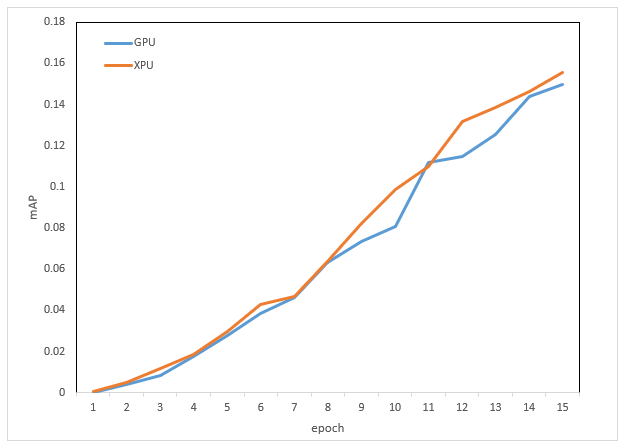

### 测试数据集下载
参见[测试数据集下载](../../benchmarks/detr/README.md#测试数据集下载地址)

### 昆仑芯XPU配置与运行信息参考
#### 环境配置
- ##### 硬件环境
  - 机器型号: 昆仑芯AI加速器组R480-X8
  - 加速卡型号: 昆仑芯AI加速卡R300
  - 多机网络类型、带宽: InfiniBand，200Gb/s

- ##### 软件环境
  - OS版本：Ubuntu 20.04
  - OS kernel版本: 5.4.0-26-generic
  - 加速卡驱动版本：4.0.25
  - Docker镜像和版本：pytorch1.12.1-cpu-ubuntu20.04:v0.01
  - 训练框架版本：xmlir+d017303d  [xmlir下载](https://bd.bcebos.com/klx-pytorch-ipipe-bd/flagperf/archives/d017303d/xmlir-0.0.1-cp38-cp38-linux_x86_64.whl)
  - 训练编译器版本：xacc+d017303d [xacc下载](https://bd.bcebos.com/klx-pytorch-ipipe-bd/flagperf/archives/d017303d/xacc-0.1.0-cp38-cp38-linux_x86_64.whl)
  - 依赖软件版本：pytorch-1.12.1+cpu

#### 运行情况

* 通用指标

| 指标名称       | 指标值                         | 特殊说明                                    |
| -------------- | ------------------------------ | ------------------------------------------- |
| 任务类别       | 目标检测、全景分割             |                                             |
| 模型           | detr                           |                                             |
| 数据集         | coco2017            |                                             |
| 数据精度       | precision,见“性能指标”         | 可选fp32/amp/fp16                           |
| 超参修改       | fix_hp,见“性能指标”            | 跑满硬件设备评测吞吐量所需特殊超参          |
| 硬件设备简称   | R300                   |                                             |
| 硬件存储使用   | mem(actual/total),见“性能指标” | 通常称为“显存”,单位为GiB                    |
| 端到端时间     | e2e_time,见“性能指标”          | 总时间+Perf初始化等时间                     |
| 总吞吐量       | p_whole,见“性能指标”           | 实际训练样本数除以总时间(performance_whole) |
| 训练吞吐量     | p_train,见“性能指标”           | 不包含每个epoch末尾的评估部分耗时           |
| **计算吞吐量** | **p_core,见“性能指标”**        | 不包含数据IO部分的耗时(p3>p2>p1)            |
| 训练结果       | mAP,见“性能指标”               | 所有类别的 Average Precision（平均精度）的均值  |
| 额外修改项     | 无                             |                                             |

* 性能指标
  
| 配置                | precision | fix_hp        | e2e_time | p_whole | p_train | p_core | mAP    | mem       |
| ------------------- | --------- | ------------- | -------- | ------- | ------- | ------ | ------ | --------- |
| R300单机8卡（1x8）  | fp32      | bs=8,lr=0.0001    |     |      |      |    |        |  15.0/32.0  |
| R300单机单卡（1x1） | fp32      | bs=8,lr=0.0001   |     |      |      |     |         |  10.0/32.0 |
| R300两机8卡（2x8）  | fp32      | bs=8,lr=0.0001   |     |      |      |     |       |    |

### 收敛曲线
