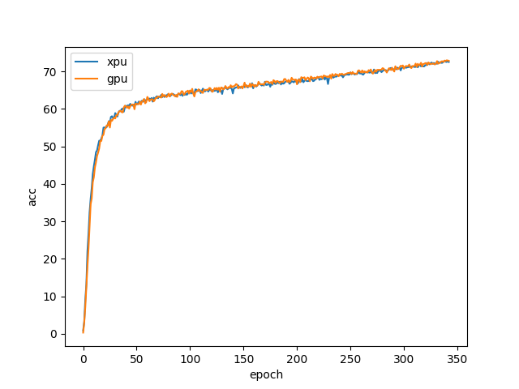

### 模型Checkpoint下载
[模型Checkpoint下载](../../benchmarks/efficientnet/README.md#模型checkpoint)
### 测试数据集下载
[测试数据集下载](../../benchmarks/efficientnet/README.md#数据集)

### 昆仑芯XPU配置与运行信息参考
#### 环境配置
- ##### 硬件环境
  - 机器型号: 昆仑芯AI加速器组R480-X8
  - 加速卡型号: 昆仑芯AI加速卡R300
  - 多机网络类型、带宽: InfiniBand，200Gb/s

- ##### 软件环境
  - OS版本：Ubuntu 20.04
  - OS kernel版本: 5.4.0-26-generic
  - 加速卡驱动版本：4.0.25
  - Docker镜像和版本：pytorch1.12.1-cpu-ubuntu18.04:v0.04
  - 训练框架版本：xmlir+e70db8f6
  - 依赖软件版本：pytorch-1.12.1+cpu

### 运行情况
| 训练资源 | 配置文件        | 运行时长(s) | 目标精度 | 收敛精度 | Steps数 | 性能 (samples/s)|
| -------- | --------------- | ----------- | -------- | -------- | ------- | ---------------- |
| 单机1卡  | config_R300x1x1 |      |       |    |     |             |
| 单机2卡  | config_R300x1x2 |      |       |    |     |             |
| 单机4卡  | config_R300x1x4 |      |       |    |     |             |
| 单机8卡  | config_R300x1x8 |      |   82.672    | 72.666   |  868540   |             |
| 两机8卡  | config_R300x2x8 |      |       |    |     |             |

### 收敛曲线

### 许可证

Apache 2.0 license。
